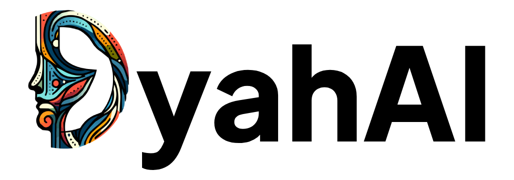

<p align="center">
  
</p>

<p align="center">
DyahAI is an AI platform that lets users transform ordinary images into unique works of art with customizable styles. Powered by Web3 technology and smart contracts. DyahAI offers a secure, decentralized, and high-quality experience, producing high-resolution images suitable for various needs.


## 📝 Table of Contents

- [Get Started](#get-started)
  - [Installation](#installation)
  - [Usage](#usage)
- [Contributors](#contribution)

## 🔗 Get Started

### :hammer: Installation

Open PowerShell or Windows Command Prompt in administrator mode by right-clicking and selecting "Run as administrator",</br>
enter the wsl --install command, then restart your machine. </br>
[WSL windows installation step](https://learn.microsoft.com/en-us/windows/wsl/install)

```sh
wsl --install
```

Open your WSL, and install dfx.

```sh
sh -ci "$(curl -fsSL https://internetcomputer.org/install.sh)"
```

Next step you can git clone this repository.

```sh
git clone https://github.com/WAW1311/DyahAI
```

Open this project directory.

```sh
cd website
```

Install all required module.

```sh
npm i
```

### 💡 Usage

Open WSL Ubuntu, start your dfx.

```sh
dfx start --clean --background
```

Deploy this project, If you want to deploy in local.

```sh
dfx deploy
```

if you want to deploy in production :

```sh
dfx deploy --network ic
```

### Contributors ❤
<a href="https://github.com/WAW1311/DyahAI/graphs/contributors">
  
</a>
